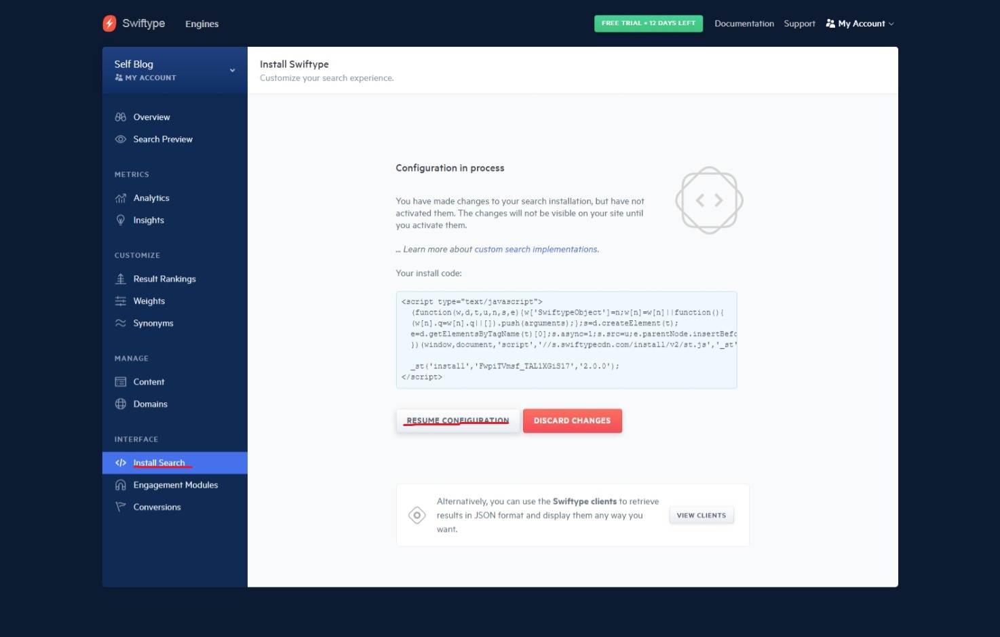
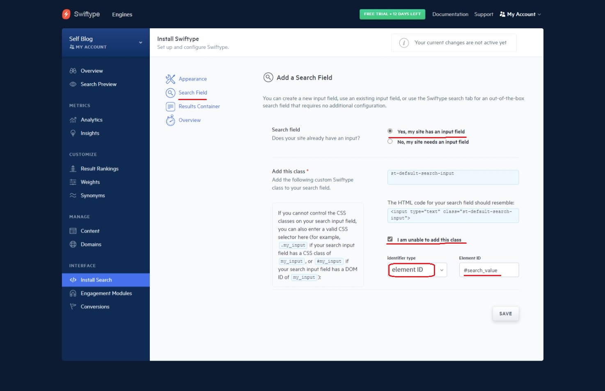
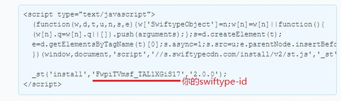
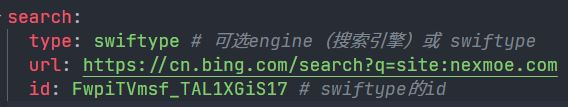
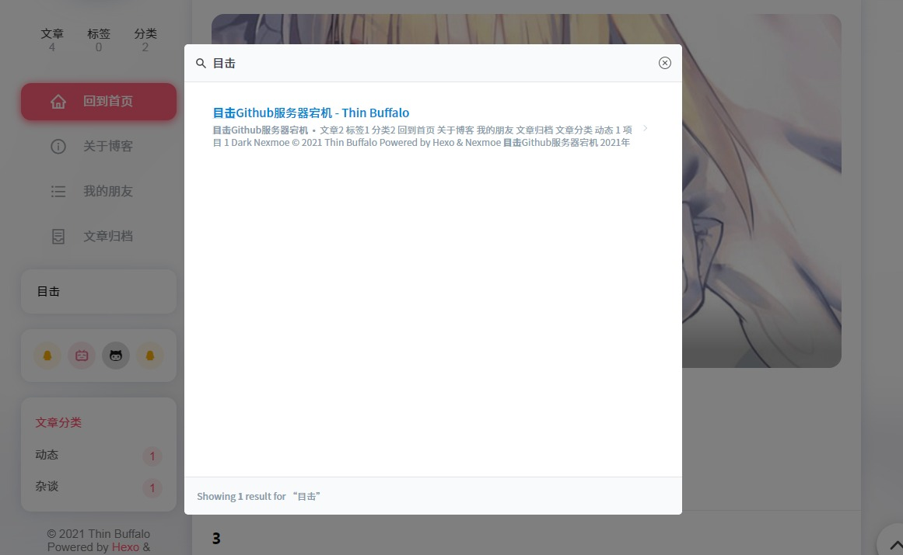

# Swiftype 启用教程
## 配置 Swiftype（必读）
- 在 Swiftype 中创建搜索引擎并抓取网站内容后，进入你的引擎仪表盘，进入`Install Search`，点击`Resume Configuration`



- 点击`Search Field`，在`Search Field`项中选择`Yes, my site has an input field`，并在`Add this class`中选中`I am unable to add this class`

- 选择`identifier type`为`element ID`，然后再在`Element ID`中输入：
```
#search_value
```
> 由于Swiftype为`st-default-search-input`提供了`css`，目前暂时只能指定输入框id


## 在博客中应用 Swiftype
- 打开你的博客配置文件，将`search`项下的`type`设置为`swiftype`

- 转到你的Swiftype引擎仪表盘，进入`Install Search`，在你的安装代码（`install code`）的如图位置得到你的`swiftype-id`，并填入博客配置文件`search`项下的`id`项



完成后类似下图：



实例：

