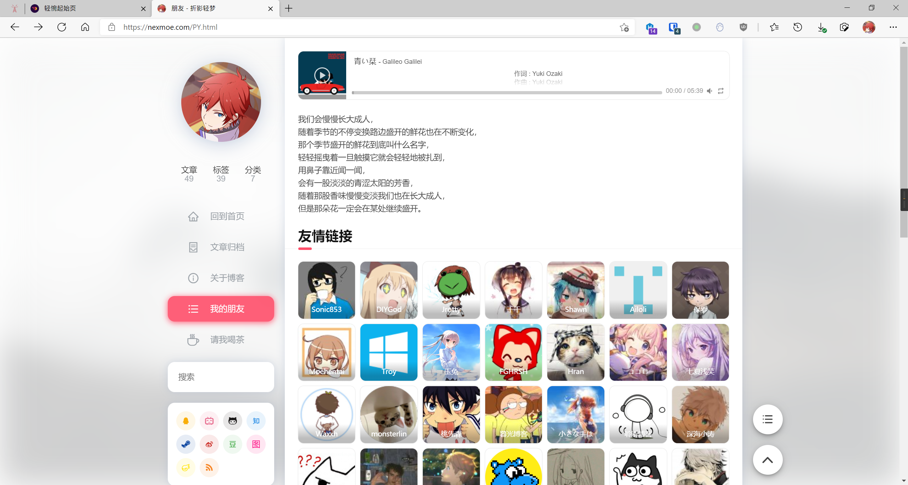

# 友情链接

## 创建页面

在站点根目录下的 `source` 文件夹内创建一个 `.md` 文件，文件名和路径根据个人喜好决定，会决定渲染生成以后页面的路径。

在文件中写入以下内容：

```yaml
---
title: links
date: 2013/7/13 20:46:25
layout: py
permalink: PY.html
---
```

> title 可以更换为自己喜欢的标题 permalink 为本页面地址

参考：https://hexo.io/zh-cn/docs/front-matter

## 添加友链

在 `.md` 中直接添加以下内容即可

```markdown
- [](https://example.com/ "标题")
```

例如

```markdown
- [](https://nexmoe.com/ "折影轻梦")
```

## 演示

https://nexmoe.com/PY.html

