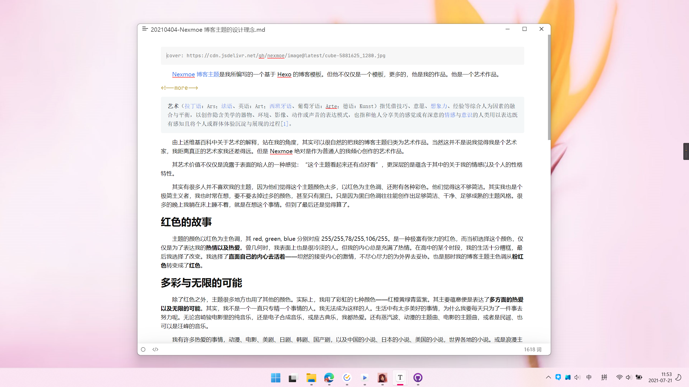

# 常见问题

## 未安装 wordcount

有时候运行错误会有 wordcount 这一关键词的报错，运行以下命令即可

```shell
npm i --save hexo-wordcount
```

## 代码高亮

自2.9.0版本后，需要在 _config.yml 文件中进行如下配置使用高亮

```yaml
highlight:
  enable: true
  hljs: true
  auto_detect: true
```

更多内容：[代码高亮 | Hexo](https://hexo.io/zh-cn/docs/syntax-highlight#Highlight-js)

## 首页取文章概述

Hexo 在写作的时候（**许多博客都是这样的**），需要在文中添加 `<!--more-->` 则该标记之前的部分就会成为该文章的概述，显示在首页里

**Hexo 在 `<!--more-->` 需要有一段内容**



更多内容：[标签插件（Tag Plugins） | Hexo](https://hexo.io/zh-cn/docs/tag-plugins#文章摘要和截断)

