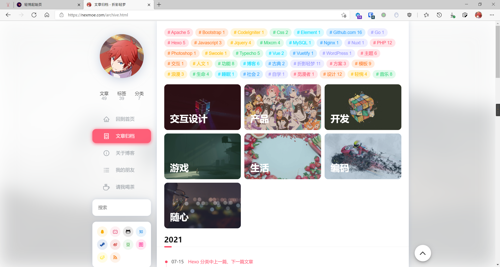

# 归档页面

## 使用

在站点根目录下的 `source` 文件夹内创建一个 `.md` 文件，文件名和路径根据个人喜好决定，会决定渲染生成以后页面的路径。

在文件中写入以下内容：

```yaml
---
title: 文章归档
layout: archives
---
```

> title 可以更换为自己喜欢的标题 permalink 为本页面地址

参考：<https://hexo.io/zh-cn/docs/front-matter>

## 演示

源码：<https://github.com/nexmoe/nexmoe.com/blob/main/source/archive.md?plain=1>

[文章归档 - 折影轻梦 (nexmoe.com)](https://nexmoe.com/archive.html)



## 关于分类的图片

分类的图片来自该分类最新文章的图片。

### 解析

有的朋友布置完之后发现自己的页面是这样的：  
  
而大佬的页面长这样：  
  
~~于是你开始思考。~~  
好吧，如果你打开主题目录下的`layout\archives.ejs`文件，可以看到这样一段代码：  

```html
  <div class="categories nexmoe-rainbow-fill">
        <% site.categories.sort('name').map(function(category){  %>
            <% let coverx = "" %>
            <% category.posts.sort('-date').map(function(post){  %>
                
                <% if(post.cover!==undefined && coverx==""){ %> 
                    <% coverx = post.cover %> 
                <% } %>
            <% }) %>

            <a class="mdui-ripple" href="<%- url_for(category.path) %>">
                <div class="bg" style="background-image:url(<%= coverx %>)"></div>
                <h1><%= category.name %></h1>
            </a>
        <% }) %>
    </div>
```

通过分析代码，我们发现，分类的图片来自最新的使用该分类的文章的图片。  
其实，可以更改这一行代码`<% if(post.cover!==undefined && coverx==""){ %>`, 删去`&& coverx==""`, 再在`<% let coverx = "" %>`中`coverx = ""`的双引号中间放入一个图片的 URL 或者随机图片 API 的 URL 以作到该分类下文章无单独设置的封面时使用某一/随机图片作为封面。
